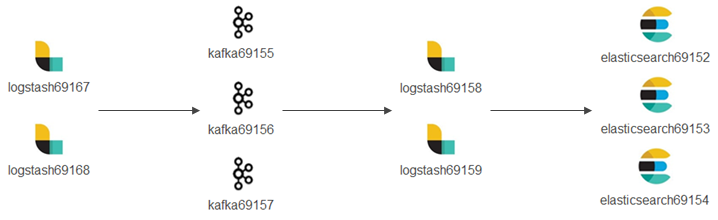

ELK Stack + Kafka End to End Practice
======================================

We have learned how to configure an ELK Stack from end to end with the previous chapter. Such a configuration is able to support most use cases. However, for a production environment which scales out unlimitedly, bottlenecks still exists:

- Logstash needs to process logs with pipelines and filters which cost considerable time, it may become a bottleneck if log bursts exist;
- Elasticsearch needs to index logs which cost time too, and it becomes a bottleneck when log bursts happen.

The above mentioned bottlenecks can be smoothed by adding more Logstash deployment and scaling Elasticsearch cluster of course, they can also be smoothed by introducing a cache layer in the middle like all other IT solutions (such as introducing Redis in the middle of the database access path). One of the most popular solutions leveraging a cache layer is integrating Kafka into the ELK stack. We will cover how to set up such an environemnt in this chapter.

Architecture
--------------

When Kafka is leveraged as a cache layer in ELK Stack, an architecture as below will be used:

.. image:: images/elk_kafka_arch.png

The details of this can be found from `Deploying and Scaling Logstash <https://www.elastic.co/guide/en/logstash/current/deploying-and-scaling.html>`_

Demonstration Enviroment
-------------------------

Based on the knowledge introducted above, our demonstration environment will be architectured as below:

The detailed enviroment is as below:

- logstash69167/69168 (hostnames: e2e-l4-0690-167/168): receive logs from syslog, filebeat, etc. and forward/produce logs to Kafka topics;
- kafka69155/156/157 (hostnames: e2e-l4-0690-155/156/157): kafka cluster

  - zookeeper will also be installed on these 3 x nodes;
  - kafka manager will be installed on kafka69155;

- logstash69158/69159 (hostnames: e2e-l4-0690-158/159): consume logs from kafka topics, process logs with pipelines, and send logs to Elasticsearch;
- elasticsearch69152/69153/69154 (hostnames: e2e-l4-0690-152/153/154): Elasticsearch cluster

  - Kibana will be installed on elasticsearch69152

- Data sources such as syslog, filebeat, etc. follow the same configuration as when Kafka is not used, hence we ignore their configuration in this chapter.

Deployment
-----------

Elasticsearch Deployment
~~~~~~~~~~~~~~~~~~~~~~~~~~

The installation process has already been documented by this document, please refer to previous chapters. We will only list configurations and commands in this section.

1. Install Elasticsearch on elasticsearch69152/69153/69154;
2. Configs on each node (/etc/elasticsearch/elasticsearch.yml):

   - elasticsearch69152

     ::

       cluster.name: edc-elasticsearch
       node.name: e2e-l4-0690-152
       path.data: /var/lib/elasticsearch
       path.logs: /var/log/elasticsearch
       network.host: 0.0.0.0
       discovery.seed_hosts: ["e2e-l4-0690-152", "e2e-l4-0690-153", "e2e-l4-0690-154"]
       cluster.initial_master_nodes: ["e2e-l4-0690-152", "e2e-l4-0690-153", "e2e-l4-0690-154"]

   - elasticsearch69153

     ::

       cluster.name: edc-elasticsearch
       node.name: e2e-l4-0690-153
       path.data: /var/lib/elasticsearch
       path.logs: /var/log/elasticsearch
       network.host: 0.0.0.0
       discovery.seed_hosts: ["e2e-l4-0690-152", "e2e-l4-0690-153", "e2e-l4-0690-154"]
       cluster.initial_master_nodes: ["e2e-l4-0690-152", "e2e-l4-0690-153", "e2e-l4-0690-154"]

   - elasticsearch69154

     ::

       cluster.name: edc-elasticsearch
       node.name: e2e-l4-0690-154
       path.data: /var/lib/elasticsearch
       path.logs: /var/log/elasticsearch
       network.host: 0.0.0.0
       discovery.seed_hosts: ["e2e-l4-0690-152", "e2e-l4-0690-153", "e2e-l4-0690-154"]
       cluster.initial_master_nodes: ["e2e-l4-0690-152", "e2e-l4-0690-153", "e2e-l4-0690-154"]

3. Start Elasticsearch service on each node:

   ::

     systemctl disable firewalld
     systemctl enable elasticsearch
     systemctl start elasticsearch

4. Verify (on any node): 3 x alive nodes should exist and one master node is elected successfully

   ::

     [root@e2e-l4-0690-152]# curl -XGET 'http://localhost:9200/_cluster/state?pretty'

Kibana Deployment
~~~~~~~~~~~~~~~~~~

The installation process has already been documented by this document, please refer to previous chapters. We will only list configurations and commands in this section.

1. Install Kibana on elasticsearch69152;
2. Configure Kibana(/etc/kibana/kibana.yml):

   ::

     server.host: "0.0.0.0"
     server.name: "e2e-l4-0690-152"
     elasticsearch.hosts: ["http://e2e-l4-0690-152:9200", "http://e2e-l4-0690-153:9200", "http://e2e-l4-0690-154:9200"]

3. Start the service on each node:

   ::

     systemctl enable kibana
     systemctl start kibana

4. Verify: access http://10.226.69.152:5601 to verify that Kibana is up and running.

Zookeeper Deployment
~~~~~~~~~~~~~~~~~~~~~~

Zookeeper is a must before running a Kafka cluster. For demonstration purpose, we deploy a Zookeeper cluster on the same nodes as the Kafka cluster, A.K.A kafka69155/69156/69157.

1. `Download zookeeper <https://zookeeper.apache.org/releases.html#download>`_;
2. There is no need to do any installation, decompressing the package is enough;
3. Configure zookeeper on each node(conf/zoo.cfg):

   ::

     tickTime=2000
     initLimit=10
     syncLimit=5
     dataDir=/var/lib/zookeeper
     clientPort=2181

     server.1=10.226.69.155:2888:3888
     server.2=10.226.69.156:2888:3888
     server.3=10.226.69.157:2888:3888

4. Create file /var/lib/zookeeper/myid with content 1/2/3 on each node:

   ::

     echo 1 > /var/lib/zookeeper/myid # kafka69155
     echo 2 > /var/lib/zookeeper/myid # kafka69156
     echo 3 > /var/lib/zookeeper/myid # kafka69157

5. Start Zookeeper on all nodes:

   ::

     ./bin/zkServer.sh start
     ./bin/zkServer.sh status

6. Connect to Zooper for verification:

   ::

     ./bin/zkCli.sh -server 10.226.69.155:2181,10.226.69.156:2181,10.226.69.157:2181

Kafka Deployment
~~~~~~~~~~~~~~~~~~

A Kafka cluster will be deployed on kafka69155/69156/69157.

1. Kafka does not need any installation, downloading and decompressing a tarball is enough. Please refer to `Kafka Quickstart <https://kafka.apache.org/quickstart>`_ for reference;
2. The Kafka cluster will run on kafka69155/156/157 where a Zookeeper cluster is already running. To enable the Kafka cluster, configure each node as below(config/server.properties):

   - kafka69155:

     ::

       broker.id=0
       listeners=PLAINTEXT://0.0.0.0:9092
       advertised.listeners=PLAINTEXT://10.226.69.155:9092
       zookeeper.connect=10.226.69.155:2181,10.226.69.156:2181:10.226.69.157:2181

   - kafka69156:

     ::

       broker.id=1
       listeners=PLAINTEXT://0.0.0.0:9092
       advertised.listeners=PLAINTEXT://10.226.69.156:9092
       zookeeper.connect=10.226.69.155:2181,10.226.69.156:2181:10.226.69.157:2181

   - kafka69157:

     ::

       broker.id=1
       listeners=PLAINTEXT://0.0.0.0:9092
       advertised.listeners=PLAINTEXT://10.226.69.157:9092
       zookeeper.connect=10.226.69.155:2181,10.226.69.156:2181:10.226.69.157:2181

3. Start Kafka on all nodes:

   ::

     ./bin/kafka-server-start.sh -daemon config/server.properties

Once the Kafka cluster is running, we can go ahead configuring Logstash. When it is required to make changes to the Kafka cluster, we should shut down the cluster gracefully as below, then make changes and start the cluster again:

::

  ./bin/kafka-server-stop.sh

Kafka Manager Deployment
~~~~~~~~~~~~~~~~~~~~~~~~~

A Kafka cluster can be managed with CLI commands. However, it is not quit handy. Kafka Manager is a web based tool which makes the basic Kafka management tasks straightforward. The tool currently is maintained by Yahoo and has been renamed as CMAK (Cluster Management for Apache Kafka). Anyway, we prefer calling it Kafka Manager.

The Kafka manager will be deployed on kafka69155.

1. Download the application from `its github repo <https://github.com/yahoo/CMAK>`_;
#. After decompressing the package, change the zookeeper option as below in **conf/application.conf**:

   ::

     kafka-manager.zkhosts="e2e-l4-0690-155:2181,e2e-l4-0690-156:2181,e2e-l4-0690-157:2181"

#. Create the app deployment(a zip file will be created):

   ::

     ./sbt clean dist

#. Unzip the newly created zip file (kafka-manager-2.0.0.2.zip in this demo) and start the service:

   ::

     unzip kafka-manager-2.0.0.2.zip
     cd kafka-manager-2.0.0.2
     bin/kafka-manager

#. The Kafka manager can be accessed from http://10.226.69.155:9000/ after a while;
#. Click **Cluster->Add Cluster** and enter below information to manage our Kafka cluster:

   - Cluster Name: assign a meaningful name for this cluster
   - Cluster Zookeeper Hosts: 10.226.69.155:2181,10.226.69.156:2181,10.226.69.157:2181
   - Enable JMX Polling: yes

#. Done.

Logstash Deployment
~~~~~~~~~~~~~~~~~~~~

Based on our introduction of the demonstration environemnt, we have 2 sets of Logstash deployment:

- Log Producers: logstash69167/69168

  Collect logs from data sources (such as syslog, filebeat, etc.) and forward log entries to corresponding Kafka topics. The num. of such Logstash instances can be determined based on the amount of data generated by data sources.

  Actually, such Logstash instances are separated from each other. In other words, they work as standalone instances and have no knowledge on others.

- Log Consumers: logstash69158/69159

  Consume logs from Kafka topics, modify logs based on pipeline definitions and ship modified logs to Elasticsearch.

  Such Logstash instances have the identical pipeline configurations (except for client_id) and belong to the same Kafka consumer group which load balance each other.

The installation of Logstash has been covered in previous chapters, we won't cover them again in this chapter, instead, we will focus our effort on the clarification of pipeline definitions when Kafka is leveraged in the middle.

Logstash Which Produce Logs to Kafka
++++++++++++++++++++++++++++++++++++++

We are going to configure pipelines for logstash69167/69168. Each Logstash instance is responsible for consolidating logs for some specified data sources.

- logstash69167: consolidate logs for storage arrays and application solutions based on Linux;
- logstash69168: consolidate logs for ethernet switches and application solutions based on Windows.

1. Define pipelines(/etc/logstash/conf.d)

   - logstash69167

     ::

       # /etc/logstash/conf.d/ps_rhel.conf
       input {
         beats {
           port => 5045
           tags => ["server", "filebeat", "ps", "rhel"]
         }
       }

       filter {
         mutate {
           rename => ["host", "server"]
         }
       }

       output {
         kafka {
           id => "ps-rhel"
           topic_id => "ps-rhel"
           codec => "json"
           bootstrap_servers => "10.226.69.155:9092,10.226.69.156:9092,10.226.69.157:9092"
         }
       }

       # /etc/logstash/conf.d/sc_sles.conf
       input {
         beats {
           port => 5044
           tags => ["server", "filebeat", "sc", "sles"]
         }
       }

       filter {
         mutate {
           rename => ["host", "server"]
         }
       }

       output {
         kafka {
           id => "sc-sles"
           topic_id => "sc-sles"
           codec => "json"
           bootstrap_servers => "10.226.69.155:9092,10.226.69.156:9092,10.226.69.157:9092"
         }
       }

       # /etc/logstash/conf.d/pssc.conf
       input {
         udp {
           port => 514
           tags => ["array", "syslog", "sc", "ps"]
         }
       }

       output {
         kafka {
           id => "pssc"
           topic_id => "pssc"
           codec => "json"
           bootstrap_servers => "10.226.69.155:9092,10.226.69.156:9092,10.226.69.157:9092"
         }
       }

       # /etc/logstash/conf.d/unity.conf
       input {
         udp {
           port => 5000
           tags => ["array", "syslog", "unity"]
         }
       }

       output {
         kafka {
           id => "unity"
           topic_id => "unity"
           codec => "json"
           bootstrap_servers => "10.226.69.155:9092,10.226.69.156:9092,10.226.69.157:9092"
         }
       }

       # /etc/logstash/conf.d/xio.conf
       input {
         udp {
           port => 5002
           tags => ["array", "syslog", "xio"]
         }
       }

       output {
         kafka {
           id => "xio"
           topic_id => "xio"
           codec => "json"
           bootstrap_servers => "10.226.69.155:9092,10.226.69.156:9092,10.226.69.157:9092"
         }
       }

   - logstash69168

     ::

       # /etc/logstash/conf.d/ethernet_switch.conf
       input {
         udp {
           port => 514
           tags => ["switch", "syslog", "network", "ethernet"]
         }
       }

       output {
         kafka {
           id => "ether-switch"
           topic_id => "ether-switch"
           codec => "json"
           bootstrap_servers => "10.226.69.155:9092,10.226.69.156:9092,10.226.69.157:9092"
         }
       }

       # /etc/logstash/conf.d/vnx_exchange.conf
       input {
         beats {
           port => 5044
           tags => ["server", "winlogbeat", "vnx", "windows", "exchange"]
         }
       }

       filter {
         mutate {
           rename => ["host", "server"]
         }
       }

       output {
         kafka {
           id => "vnx-exchange"
           topic_id => "vnx-exchange"
           codec => "json"
           bootstrap_servers => "10.226.69.155:9092,10.226.69.156:9092,10.226.69.157:9092"
         }
       }

       # /etc/logstash/conf.d/vnx_mssql.conf
       input {
         beats {
           port => 5045
           tags => ["server", "winlogbeat", "vnx", "windows", "mssql"]
         }
       }

       filter {
         mutate {
           rename => ["host", "server"]
         }
       }

       output {
         kafka {
           id => "vnx-mssql"
           topic_id => "vnx-mssql"
           codec => "json"
           bootstrap_servers => "10.226.69.155:9092,10.226.69.156:9092,10.226.69.157:9092"
         }
       }

2. Enable pipelines (/etc/logstash/pipelines.yml):

   - logstash69167:

     ::

       - pipeline.id: ps_rhel
         path.config: "/etc/logstash/conf.d/ps_rhel.conf"
       - pipeline.id: sc_sles
         path.config: "/etc/logstash/conf.d/sc_sles.conf"
       - pipeline.id: pssc
         path.config: "/etc/logstash/conf.d/pssc.conf"
       - pipeline.id: unity
         path.config: "/etc/logstash/conf.d/unity.conf"
       - pipeline.id: xio
         path.config: "/etc/logstash/conf.d/xio.conf"

   - logstash69168:

     ::

       - pipeline.id: ethernet_switch
         path.config: "/etc/logstash/conf.d/ethernet_switch.conf"
       - pipeline.id: vnx_exchange
         path.config: "/etc/logstash/conf.d/vnx_exchange.conf"
       - pipeline.id: vnx_mssql
         path.config: "/etc/logstash/conf.d/vnx_mssql.conf"

3. Start Logstash servers on all nodes:

   ::

     systemctl start logstash

4. Verify topics are successfully created on Kafka:

   ::

     ssh root@kafka69155/156/157
     ./bin/kafka-topics.sh -bootstrap-server "10.226.69.155:9092,10.226.69.156:9092,10.226.69.157:9092" --list

5. Verify logs are sent to Kafka successfully:

   ::

     ssh root@kafka69155/156/157
     ./bin/kafka-console-consumer.sh -bootstrap-server "10.226.69.155:9092,10.226.69.156:9092,10.226.69.157:9092" --topic <topic name>

Now, we have our Logstash instances configured as Kafka producers. Before moving forward, it is worthwhile to introduce some tips on pipeline configurations when Kafka is used as the output plugin.

- Never define complicated filters for pipelines of such Logstash instances since they may increase latency;
- Add tags to the input section to ease the effort of log search/classification with Kibana;
- Specify different **id** with meaningful names for different pipelines;
- Rename the **host** field to some other meaningful name if syslog is also a data source in the setup. Refer to the **tips** chapter for the explanation about this.

Logstash Which Consume Logs from Kafka
++++++++++++++++++++++++++++++++++++++++

We are going to configure pipelines for logstash69158/69159. These two Logstash instances have identical pipeline definitions (except for client_id) and consume messages from Kafka topics evenly by leveraging the consumer group feature of Kafka.

Since logs are cached in Kafka safely, it is the right place to define complicated filters with pipelines to modify log entires before sending them to Elasticsearch. This won't lead to bottlenecks since logs are already there in Kafka, the only impact is that you may need to wait for a while before you are able to see the logs in Elasticsearch/Kibana. And if it is time sensitive to see logs from Elasticsearch/Kibana, more Logstash instances belong to the same consumer group can be added to load balance the processing.

1. Define pipelines(/etc/logstash/conf.d): **client_id** should always be set with different values

   ::

     # /etc/logstash/conf.d/kafka_array.conf
     input {
       kafka {
         client_id => "logstash69158-array"
         # client_id => "logstash69159-array"
         group_id => "logstash-array"
         topics => ["unity", "vnx", "xio", "pssc", "powerstore"]
         codec => "json"
         bootstrap_servers => "10.226.69.155:9092,10.226.69.156:9092,10.226.69.157:9092"
       }
     }

     output {
       elasticsearch {
         hosts => ["http://e2e-l4-0690-152:9200", "http://e2e-l4-0690-153:9200", "http://e2e-l4-0690-154:9200"]
         index => "edc-storage-%{+YYYY.MM.dd}"
       }
     }

     # /etc/logstash/conf.d/kafka_server.conf
     input {
       kafka {
         client_id => "logstash69158-server"
         # client_id => "logstash69159-server"
         group_id => "logstash-server"
         topics => ["sc-sles", "ps-rhel", "vnx-exchange", "vnx-mssql"]
         codec => "json"
         bootstrap_servers => "10.226.69.155:9092,10.226.69.156:9092,10.226.69.157:9092"
       }
     }

     output {
       elasticsearch {
         hosts => ["http://e2e-l4-0690-152:9200", "http://e2e-l4-0690-153:9200", "http://e2e-l4-0690-154:9200"]
         index => "edc-server-%{+YYYY.MM.dd}"
       }
     }

     # /etc/logstash/conf.d/kafka_switch.conf
     input {
       kafka {
         client_id => "logstash69158-switch"
         # client_id => "logstash69159-switch"
         group_id => "logstash-switch"
         topics => ["ether-switch"]
         codec => "json"
         bootstrap_servers => "10.226.69.155:9092,10.226.69.156:9092,10.226.69.157:9092"
       }
     }

     output {
       elasticsearch {
         hosts => ["http://e2e-l4-0690-152:9200", "http://e2e-l4-0690-153:9200", "http://e2e-l4-0690-154:9200"]
         index => "edc-ethernet-%{+YYYY.MM.dd}"
       }
     }

2. Enable pipelines on all nodes(/etc/logstash/pipelines.yml):

   ::

     - pipeline.id: kafka_array
       path.config: "/etc/logstash/conf.d/kafka_array.conf"
     - pipeline.id: kafka_server
       path.config: "/etc/logstash/conf.d/kafka_server.conf"
     - pipeline.id: kafka_switch
       path.config: "/etc/logstash/conf.d/kafka_switch.conf"

3. Start logstash on all nodes:

   ::

     systemctl start logstash

After configuring and starting Logstash, logs should be able to be sent to Elasticsearch and can be checked from Kibana.

Now, we have our Logstash instances configured as Kafka consumers. Before moving forward, it is worthwhile to introduce some tips on pipeline configurations when Kafka is used as the input plugin.

- **client_id** should always be set with *different values* for each pipeline on different Logstash instances. This field is used to identify consumers on Kafka;
- **group_id** should be set with the *idenfical value* for the same pipeline on different Logstsh instances. This field is used to identify consumer groups on Kafka, and load balance won't work if the value are different.

Data Source Configuration
--------------------------

Data sources are servers, switches, arrays, etc. which send logs to Logstash through beat, syslog, etc. Configuring them follows the same steps as when there is no Kafka integrated, please refer to previous chapter accordingly.

Conclusion
------------

We have configured a demonstration environment with Kafka integrated with ELK Stack. By integrating Kafka, log processing performance can be boosted(adding a cache layer) and more potential applications can be integrated (consume log messages from Kafka and perform some special operations such as ML).
