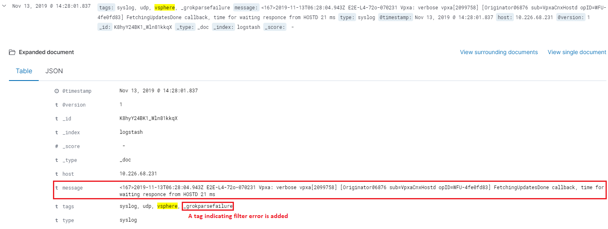
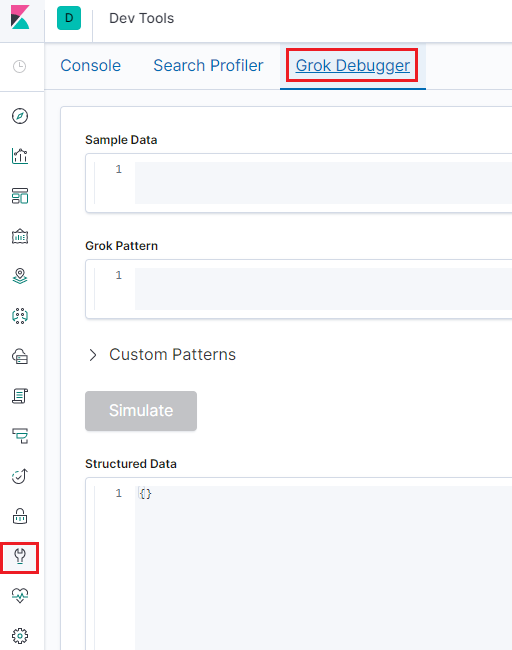
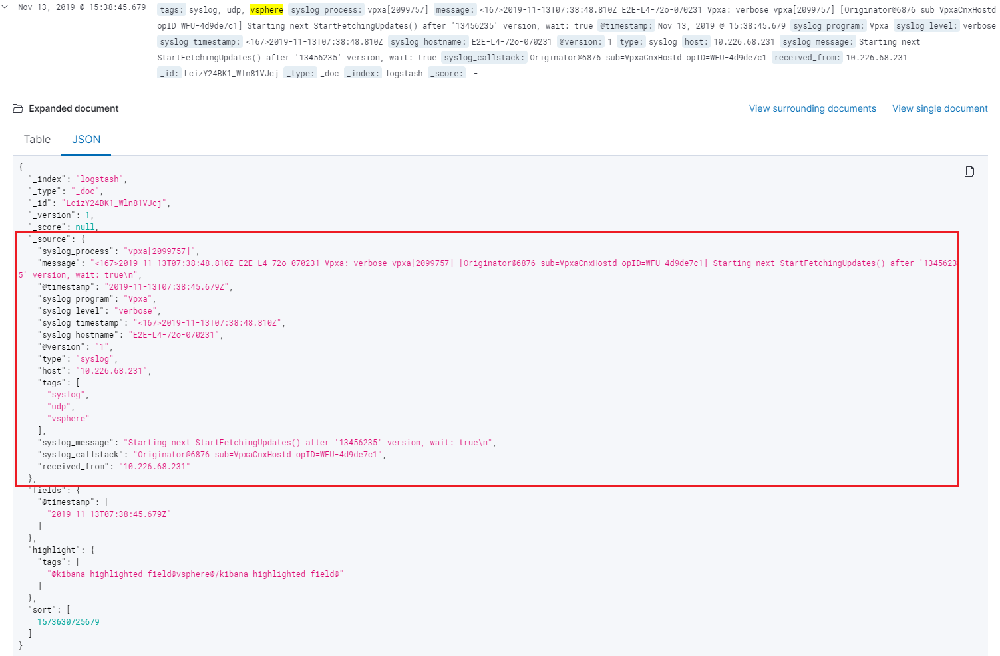

Grok Debugger
==============

In the previous chapter on configuring ELK stack for the end to end production environment, someone may notice that we use the same grok expression for all syslog pipelines, no matter if they are from XtremIO, vSphere, or Unity.

The pattern is as below:

::

  %{SYSLOGTIMESTAMP:syslog_timestamp} %{DATA:syslog_hostname} %{DATA:syslog_program}(?:\[%{POSINT:syslog_pid}\])?: %{GREEDYDATA:syslog_message}

Although, this is the standard format for syslog, but it is a kind of soft requirement. A syslog record may contain much more fields, but may contain fewer fields also. Under such condtion, the expression won't work.

In fact, the expression does not work for vSphere syslog on our production environment. We will show how to fix grok expression issue with "Grok Debugger" provided by Kibana in this chapter.

Logstash pipeline behavior for failed filters
-----------------------------------------------

When data (logs, metrics, etc.) comes into the process of a Logstash pipeline (input), Logstash will modify data based on configured filter (filter plugins). If a filter fail to process data, Logstash won't get blocked but just add some tags and go ahead forward the original data to destionations (output).

Here is an example of log record which cannot be processed correctly by the grok pattern we previously defined:

Based on the example, we can see the orignal log record as below is sent to Elasticsearch directly. Fields (syslog_timestamp, syslog_hostname, etc.) which should be added after a successfuly grok prcoessing do not exist for the record:

::

  2019-11-13T06:30:20.511Z E2E-L4-72o-070231 Vpxa: verbose vpxa[2099751] [Originator@6876 sub=VpxaCnxHostd opID=WFU-6ae80d08] Completed FetchingUpdatesDone callback in 0 ms, time for waiting responce from HOSTD 71 ms

We will fix this in the coming sections.

Kibana Grok Debugger
---------------------

Since it is a frequent task tuning grok expressions, Kibana provides a debugger with it:

With this tool, we can debug our grok expression lively. Let's fix our above mentioned issues with it.

1. Paste our log record into the **Sample Data** field of the Grok Debugger;
2. Open the `predefined grok patterns <https://github.com/logstash-plugins/logstash-patterns-core/blob/master/patterns/grok-patterns>`_ for reference;
3. Take all the inforamtion into field syslog_message:

   .. image:: images/grok_debugger_message.png

4. Spit out the syslog_timestamp field:

   ::

     %{DATA:syslog_timestamp} %{GREEDYDATA:syslog_message}

5. Spit out the syslog_hostname field:

   ::

     %{DATA:syslog_timestamp} %{DATA:syslog_hostname} %{GREEDYDATA:syslog_message}

6. Spit out the syslog_program field:

   ::

     %{DATA:syslog_timestamp} %{DATA:syslog_hostname} %{DATA:syslog_program}: %{GREEDYDATA:syslog_message}

7. Continue similar operations until the full record is parsed successfully:

   ::

     %{DATA:syslog_timestamp} %{DATA:syslog_hostname} %{DATA:syslog_program}: %{DATA:syslog_level} %{DATA:syslog_process} (?:\[%{DATA:syslog_callstack}\])? %{GREEDYDATA:syslog_message}

8. The full result is as below:

   .. image:: images/grok_debugger_full.png

Our new updated grok expression is ready. We can go to the Logstash pipe configuraiton (/etc/logstash/conf.d/syslog_vsphere.conf) and make changes accordingly:

::

  input {
    tcp {
      type => "syslog"
      port => 5002
      tags => ["syslog", "tcp", "vsphere"]
    }
    udp {
      type => "syslog"
      port => 5002
      tags => ["syslog", "udp", "vsphere"]
    }
  }

  filter {
    grok {
      match => { "message" => "%{DATA:syslog_timestamp} %{DATA:syslog_hostname} %{DATA:syslog_program}: %{DATA:syslog_level} %{DATA:syslog_process} (?:\[%{DATA:syslog_callstack}\])? %{GREEDYDATA:syslog_message}" }
      add_field => [ "received_from", "%{host}" ]
    }
    date {
       match => [ "timestamp", "MMM dd HH:mm:ss", "MMM  d HH:mm:ss" ]
    }
  }

  output {
    elasticsearch {
      hosts => ["http://e2e-l4-0680-240:9200", "http://e2e-l4-0680-241:9200", "http://e2e-l4-0680-242:9200"]
    }
  }

From Kibana "Discover" view, all log records similar to the original one are parsed successfully:

Conclusion
-----------

With Grok Debugger, correct grok patterns can be defined for different log sources. Now, it is your turn to define your own expressions.
