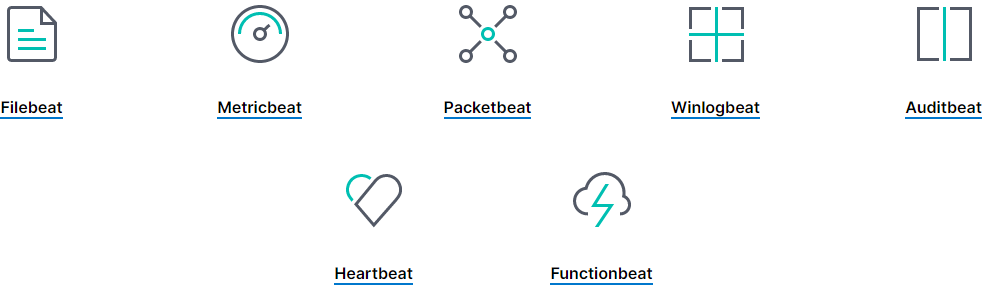

ELK Introduction
==================

What is ELK?
-------------

- ELK stands for the monitoring solution which is mainly consist of **Elasticsearch**, **Logstash** and **Kibana**;
- It has been renamed as **Elastic Stack**, since it has expanded its functions greatly through the use of **beats** and some other addons like APM servers. But people still tend to call it ELK;
- It is a distributed monitoring solution suiteable for almost any **structured** and **unstructured** data source, but not limited to log;
- It supports centralized **logging/metric/APM** monitoring;
- It is open source and can be extended easily.

.. image:: images/elk_overview.png

Main Components
----------------

Elasticsearch
~~~~~~~~~~~~~~~

Elasticsearch is the **distributed search and analytics engine** at the heart of the Elastic Stack. It provides real-time search and analytics for all types of data (structuredi and unstructured):

- Store
- Index
- Search
- Analyze

Data In
++++++++

- Elasticsearch stores complex data structures that have been serialized as **JSON documents**;
- Documents are **distributed across the cluster** and can be accessed immediately from any node;
- Documents are indexed in **near real time** (without 1 second), and full-text searches are supported through **inverted index**;
- Elasticsearch indexes all data in **every field**;
- Dynamic mapping makes **schema-less** possible through detecting and adding new fields;

Information Out
+++++++++++++++++

- REST API
- Aggregation
- Machine learning

Scalability and Resilience
++++++++++++++++++++++++++++

- Scalability: nodes can be added dynamically;
- Resilience : through the use of primary and replica shards;

.. image:: images/elk_cluster_shard.png

Logstash
~~~~~~~~~

- Unify data from disparate sources;
- Normalize data into destinations;

.. image:: images/logstash_overview.png

Kibana
~~~~~~~

Kibana is the front end GUI for Elasticsearch.

.. image:: images/kibana_overview.png

Beats
~~~~~~

Beside the main three components mentioned above, there exists a kind of lightweight data collectors which are called beats. They are installed directly (for most beats and their modules) on the data sources, and collect data for specilized purposes, which are then forwarded to Elasticsearch or Logstash.

The most frequently used beats are:

- **filebeat** : sends local file records to Logstash or ELasticsearch (work as "tail -f");
- **winlogbeat** : sends windows event logs to Logstash or Elasticsearch;
- **metricbeat** : sends system or application performance metrics to Logstash or Elasticsearch.

Because of its nature, **filebeat** is extremely suitable for consolidating application logs, e.g., MongoDB, apache, etc.

