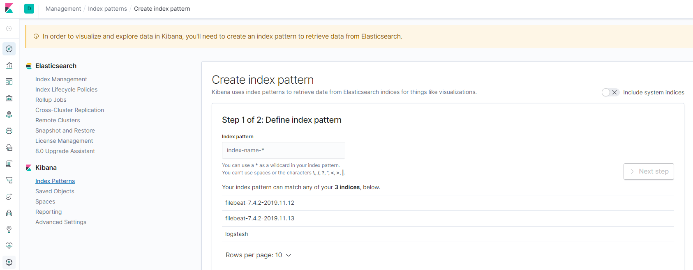
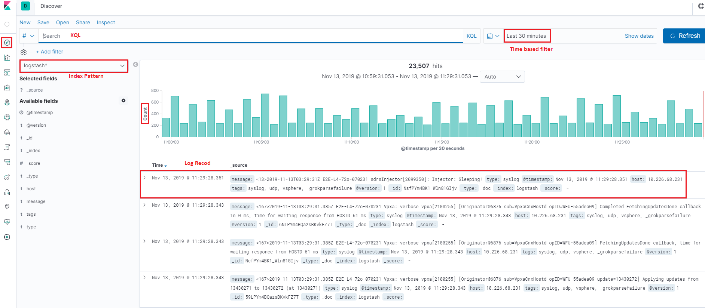

Check Logs with Kibana
========================

Kibana is the web based front end GUI for Elasticsearch. It can be used to search, view, and interact with data stored in Elasticsearch indices. Advanced data analysis and visualize can be performed with the help of Kibana smoothly.

We have completed an end to end production environement ELK stack configuration with the previous chapter. In this chapter, we will use Kibana to explore the collcted data.

Index Patterns
---------------

The first time you login Kibana (http://<IP or FQDN>:5601), a hint as **In order to visualize and explore data in Kibana, you'll need to create an index pattern to retrieve data from Elasticsearch** will be shown on the top of the page and a shortcut to create an index pattern is shown:

An index pattern tells Kibana which Elasticsearch indices you want to explore. It can match the name of a single index, or include a wildcard (*) to match multiple indices. But wait, what is an index? An index is a kind of data organization mechanism on how your data is stored and indexed. Every single piece of data sent to Elasticsearch actually is targging at an index (stored and indexed). To retrieve data, we of course need to let Kibana know the data souce (index patterns). Please refer to `this blog <https://www.elastic.co/blog/what-is-an-elasticsearch-index>`_ for more details on index.

To **create index patterns**, it is recommended to conduct the operation from the **Management** view of Kibana:

1. Go to the "Management" view, then check available indices (reload indices if there is none):

   .. image:: images/kibana_index_mgmt.png

2. Based on the name of existing indices, created index patterns:

   .. image:: images/kibana_index_pattern_1.png

   .. image:: images/kibana_index_pattern_2.png

   .. image:: images/kibana_index_pattern_3.png

3. We create index patterns for **logstash** and **filebeat**:

   .. image:: images/kibana_index_pattern_4.png

After creating index patterns, we can start exploring data from the **Discover** view:

KQL Basics
------------
