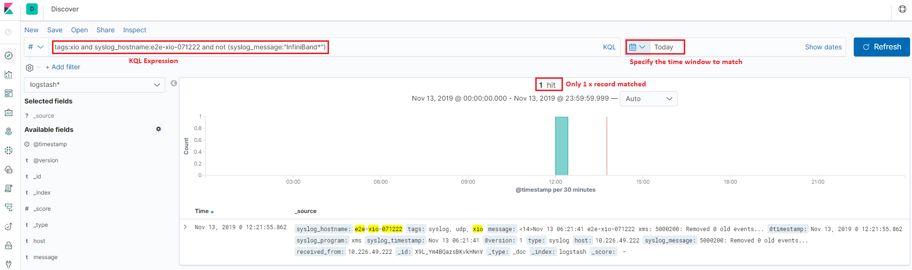

Check Logs with Kibana
========================

Kibana is the web based front end GUI for Elasticsearch. It can be used to search, view, and interact with data stored in Elasticsearch indices. Advanced data analysis and visualize can be performed with the help of Kibana smoothly.

We have completed an end to end production environement ELK stack configuration with the previous chapter. In this chapter, we will use Kibana to explore the collcted data.

Index Patterns
---------------

The first time you login Kibana (http://<IP or FQDN>:5601), a hint as **In order to visualize and explore data in Kibana, you'll need to create an index pattern to retrieve data from Elasticsearch** will be shown on the top of the page and a shortcut to create an index pattern is shown:

.. image:: images/kibana_1st_prompt.png

An index pattern tells Kibana which Elasticsearch indices you want to explore. It can match the name of a single index, or include a wildcard (*) to match multiple indices. But wait, what is an index? An index is a kind of data organization mechanism on how your data is stored and indexed. Every single piece of data sent to Elasticsearch actually is targging at an index (stored and indexed). To retrieve data, we of course need to let Kibana know the data souce (index patterns). Please refer to `this blog <https://www.elastic.co/blog/what-is-an-elasticsearch-index>`_ for more details on index.

To **create index patterns**, it is recommended to conduct the operation from the **Management** view of Kibana:

1. Go to the "Management" view, then check available indices (reload indices if there is none):

   .. image:: images/kibana_index_mgmt.png

2. Based on the name of existing indices, created index patterns:

   .. image:: images/kibana_index_pattern_1.png

   .. image:: images/kibana_index_pattern_2.png

   .. image:: images/kibana_index_pattern_3.png

3. We create index patterns for **logstash** and **filebeat**:

   .. image:: images/kibana_index_pattern_4.png

After creating index patterns, we can start exploring data from the **Discover** view by selecting a pattern:

KQL Basics
------------

To smooth the exprience of filtering logs, Kibana provides a simple language named **Kibana Query Lanagure (KQL for short)**. The syntax is really straightforward, we will introduce the basics in this section.

Simple Match
~~~~~~~~~~~~~

**Syntax**:

::

  <field name>: <word to match>

**Example**:

  - response:200

    - Search documents (log records) which have a field named "response" and its value is "200"

Quotes Match
~~~~~~~~~~~~~~

**Syntax**:

::

  <filed name>: "<words to match>"

**Example**:

- message:"Quick brown fox"

  - Search the quoted string "Quick brown fox" in the "message" field;
  - If quotes are not used, search documents which have word "Quick" in the "message" field, and have fields "brown" and "fox"

Complicated Match
~~~~~~~~~~~~~~~~~~~

**Syntax**:

- Logical combination: and, or, not
- Grouping           : ()
- Range              : >, >=, <, <=
- Wildcard           : *

**Examples**:

- response:200 and extension:php

  - Match documents whose "response" field is "200" **and** "extension" field is "php"

- response:200 and (extension:php or extension:css)

  - Match documents  whose "response" field is 200 **and** "extension" field is "php" **or** "css"

- response:200 and not (extension:php or extension:css)

  - Match documents whose "response" field is 200 **and** "extension" field is **not** "php" **or** "css"

- response:200 and bytes > 1000

  - Match documents whose "response" field is 200 and "bytes" field is in **range** larger than "1000"

- machine.os:win*

  - Match documents whose "machine" field has a subfield "os" and its value start with "win", such as "windows", "windows 2016"

- machine.os.*:"windows 10"

  - Match documents whose "machine" field has a subfiled "os" which also has subfileds and any of such subfields' value contains "windows 10"

Explore Real Data
------------------

We have introduced index patterns and KQL, it is time to have a look at real data in our production setup. All log records will be structured as JSON documents as we previously introduced, and Kibana will show a summary for related indices as below once an index pattern is selected:

.. image:: images/kibana_explore.png

As we said, log records will be formated/structured as JSON documents. Bug how? Actually, there is term called **mapping**, which performs the translation work from the original format (such as text) to JSON. Since logstash and filebeat already have internal mapping defined, we do not need to care about the details. What we should know is that the JSON documents from different data input (logstash, filebeat, etc.) may be different because of the mapping. For more information on mapping, please refer to the `offical introduction <https://www.elastic.co/guide/en/elasticsearch/reference/current/mapping.html>`_.

Below are JSON document samples from different input type:

- logstash:

  .. image:: images/kibana_logstash_json.png

- filebeat:

  .. image:: images/kibana_filebeat_json.png

Based on the samples, we see each document consist of a few fields. These fields are the key for filtering. For example, we can filter logs which are from "xio" with hostname "e2e-xio-071222"  and not related with "InfiniBand" as below:

Pretty easy, right? There is no more magic for this! Just specify your KQL with fields and value expressions, that is all!

Save Search/Query
------------------

